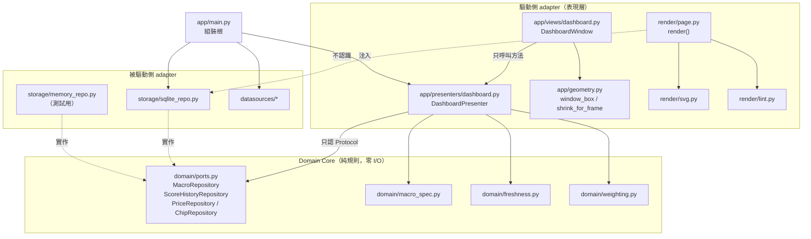

# UI_README

`market-barometer` 的**介面架構文件**。給要動這份程式碼的人看。

README.md 講「這是什麼」、CLAUDE.md 講「動它要注意什麼」、HANDOVER.md 講
「資料長什麼樣」。這一份只講**介面**：畫面怎麼組起來、事件怎麼流、狀態放在哪。

> 這裡不貼函式內容，只用符號名稱指路。想看實作請直接開對應的檔案。

---

## 1. 兩個介面，一套資料

這個專案有**兩個**介面，共用同一個資料層與同一組 domain 規則：

| | 桌面（TTK） | 網頁（GitHub Pages） |
|---|---|---|
| 進入點 | `barometer.app.main` | `docs/index.html`（密文） |
| 產生方式 | 即時渲染 widget | `tools/publish.py` 產靜態 HTML 後加密 |
| 能不能抓資料 | **能**，按鈕會打網路 | 不能，純靜態快照 |
| 分頁 | 4（總經×2、大盤×2） | 4（同上） |
| 走勢圖 | 無（純表格） | inline SVG |
| 誰看得到 | 只有這台機器 | 有密碼的人 |

**一句話：桌面是操作台，網頁是發布出去的成果。**

---

## 2. 模組互動圖



**兩條硬規定：**

1. `views/`、`presenters/`、`render/` **一律不得 import `storage/` 或 `datasources/`**。
   `tests/test_layer_boundary.py` 用 AST 掃描守著，不靠自律。
2. `app/main.py` 是**唯一**能同時認得兩邊的地方（組裝根）。

---

## 3. 畫面對照表

<details>
<summary><b>桌面程式（點開）</b></summary>

| 畫面元素 | 實作位置 | 說明 |
|---|---|---|
| 主視窗 | `app/views/dashboard.py` → `DashboardWindow` | ttkbootstrap `bs.Window`，主題 `darkly` |
| 視窗尺寸 | `app/geometry.py` → `window_box()` | 依螢幕解析度：上下 3%~87%、左右 3%~97% |
| 外框修正 | `app/geometry.py` → `shrink_for_frame()`；`DashboardWindow._fit_outer_edges` | 扣掉標題列厚度，讓**看得到的邊界**落在規格上 |
| 「強制重抓」按鈕 | `DashboardWindow.btn` → `_on_force` | 唯一會主動打網路的按鈕 |
| 自動更新提示 | `DashboardWindow.auto_label` → `_refresh_auto_label` | 顯示「N 條到期：…」 |
| 四個分頁 | `DashboardWindow.nb`（`bs.Notebook`），`TAB_TITLES` | 世界總體經濟 / 台灣總體經濟 / 台股大盤與 ETF / 美股大盤與 ETF |
| 各分頁表格 | `DashboardWindow.trees[key]`（`bs.Treeview`），`COLUMNS` | 指標／標的、最新值／分數、資料日期、頻率、備註 |
| 狀態列 | `DashboardWindow.status` ← `DashboardPresenter.status()` | **不是**「最後更新」，是「幾條序列、幾種資料日期」 |
| 圖示 | `app/main.py` → `_apply_icon` + `_set_taskbar_identity` | 三個面：Explorer（.spec）、標題列、工作列 |

</details>

<details>
<summary><b>網頁（點開）</b></summary>

| 畫面元素 | 實作位置 | 說明 |
|---|---|---|
| 解鎖畫面 | `crypto/shell.html` | WebCrypto + `sessionStorage`，零外部相依 |
| 內容容器 | `crypto/shell.html` 的 `<iframe srcdoc sandbox="allow-scripts">` | **不給** `allow-same-origin`，內層拿不到外層的 sessionStorage |
| 頁面骨架 | `render/page.py` → `render()` | 標頭、抓取時間、分頁列、四個 `<section>`、頁尾 |
| 一列指標 | `render/page.py` → `Row` / `_row_html` | 每一列自己帶資料日期與頻率 |
| 一個分頁 | `render/page.py` → `Tab` / `_tab_html` | |
| 走勢圖 | `render/svg.py` → `sparkline()` | **頻率決定畫法**：日頻連續線、月/季頻階梯＋點 |
| 分頁切換 | `render/page.py` 的 `_SCRIPT` | 純 JS，切 `hidden` 屬性 |
| 行動字眼把關 | `render/lint.py` → `assert_clean()` | 命中就讓發布失敗 |

</details>

---

## 4. 互動流程

<details>
<summary><b>開視窗（不打網路）</b></summary>

```
main() → _set_taskbar_identity() → _enable_dpi_awareness() → bs.Window()
       → _apply_icon() → DashboardWindow(root, DashboardPresenter(repo, _refresher))
           → window_box() 算尺寸 → geometry()
           → _make_tree() ×4
           → _reload_all() → Presenter.load(tab) ×4 → repo.get_macro / get_scores
           → _refresh_auto_label() → Presenter.due_summary()
           → _fit_outer_edges()
           → _schedule(AUTO_CHECK_MS, _auto_tick)
```

**整條路徑零次網路請求。** 有一個測試在數這件事。

</details>

<details>
<summary><b>切分頁（不打網路）</b></summary>

```
<<NotebookTabChanged>> → _reload_current() → _fill(key) → Presenter.load(key)
                                           → status.config(Presenter.status())
```

</details>

<details>
<summary><b>到期自動更新（可能打網路）</b></summary>

```
_auto_tick()（每 10 分鐘）
   → _refresh_auto_label()
   → Presenter.due_keys()            ← 只讀本機資料日期，不打網路
   → 有到期且不忙 → _start(Presenter.auto_refresh, …)
                       → 背景執行緒 → run_macro.run(force=False)
                       → queue.Queue → _poll() → _reload_all()
   → _schedule(AUTO_CHECK_MS, _auto_tick)
```

「到期」按各序列自己的公布頻率算（`domain/freshness.is_due`），不是固定間隔。

</details>

<details>
<summary><b>強制重抓（一定打網路）</b></summary>

```
按鈕 → _on_force() → _start(Presenter.force_refresh, "強制重抓中…")
                       → 背景執行緒 → run_macro.run(force=True)
                                    → fetch_prices.run(...)
                                    → run_scores.run(...)
                       → queue.Queue → _poll() → _reload_all()
```

</details>

<details>
<summary><b>關窗</b></summary>

```
WM_DELETE_WINDOW → on_close()
   → 背景還在跑？ → messagebox.askyesno 確認
   → _closing = True
   → after_cancel(每一個記下來的 id)     ← 少了這步會炸 invalid command name
   → worker.join(timeout=5s)             ← 少了這步會留孤兒執行緒
   → root.destroy()
```

**順序不能換。**

</details>

<details>
<summary><b>發布網頁</b></summary>

```
tools/publish.py
   → build_page.build_tabs()        ← 資料層 → view model，界線在這裡轉一次
   → render.page.render(enforce_lint=True)
   → publish_gate.Gate.should_publish(明文)   ← 比對「明文指紋」，不是密文
        └ 沒變 → 結束，docs/ 一個字都不動
   → crypto.envelope.seal()          ← 每次重新產生 salt / IV / CEK
   → crypto.shell.wrap()
   → 寫 docs/index.html
   → tools/verify_publish.py（十項驗收）
```

</details>

---

## 5. 狀態放在哪

| 狀態 | 放在哪 | 生命週期 |
|---|---|---|
| 指標快取、評分歷史、籌碼面 | SQLite（`%STOCKDATA_ROOT%\market.db`） | 永久 |
| 原始／最新價格序列 | CSV（`price_raw\`、`price_current\`） | 永久，**不進 git** |
| 目前分頁 | `bs.Notebook` 自己 | 視窗生命週期 |
| 背景工作結果 | `DashboardWindow._result`（`queue.Queue`） | 一次更新 |
| 排程中的 after id | `DashboardWindow._after_ids` | 視窗生命週期，關窗時全部取消 |
| 是否正在關閉 | `DashboardWindow._closing` | 視窗生命週期 |
| 發布指紋 | `build\*.gate.json` | 到下次發布 |
| 網頁解鎖狀態 | 瀏覽器 `sessionStorage`（存**內容金鑰**，不是密碼） | 分頁關閉即消失，最長 24 小時 |

**Presenter 自己不存畫面狀態。** 它每次 `load()` 都重新問 repo，所以桌面與網頁
不會各自累積一份會分岔的狀態。

---

## 6. 做得到與做不到

<details>
<summary><b>做得到</b></summary>

- 四個分頁顯示 24 項總經指標與 6 個大盤／ETF 標的的評分
- 每一列各自標資料日期與頻率
- 按各序列的公布頻率自動判定到期並更新
- 強制重抓（總經＋價格＋評分）
- 依螢幕解析度自動決定視窗大小
- 抓資料時視窗不凍住（背景執行緒）
- 關窗時乾淨收尾
- 產出加密網頁並驗收十項

</details>

<details>
<summary><b>做不到（刻意的）</b></summary>

- **不產生任何買賣建議。** `render/lint.py` 會讓含行動字眼的發布失敗。
- **桌面沒有走勢圖。** 圖只在網頁那一側。
- **不能在畫面上編輯任何資料。** 這是唯讀的儀表，不是輸入表單。
- **不能改門檻或權重。** 那些是程式常數，改要動 `domain/`。
- **網頁不會自己更新。** 它是發布當下的靜態快照。
- **沒有多使用者、沒有登入。** 單機單使用者。

</details>

<details>
<summary><b>已知限制</b></summary>

- 打包後在高 DPI 螢幕上，視窗外框實測落在 3.5% / 96.5% / 3.0% / 86.2%，與規格差
  約 9 px，來源是 Windows 11 的隱形調整邊框。
- 桌面端沒有籌碼面分頁（資料有，但還沒做畫面）。
- `sessionStorage` 是 per-tab 的，網頁開新分頁要重新輸入密碼。這是規格不是故障。

</details>
